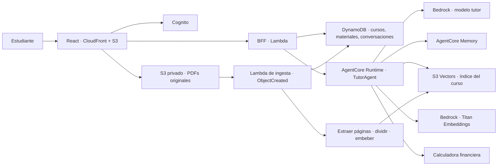

# Arquitectura y orquestación

Finantutor es un tutor conversacional para estudiantes de la Maestría en Inteligencia Artificial que cursan **Modelos financieros y evaluación de proyectos**. Utiliza un agente Strands en AgentCore Runtime, las herramientas numéricas deterministas existentes y una base de conocimiento por curso almacenada en S3 Vectors. No genera fichas.

## Conversación

1. El BFF valida identidad y propiedad del curso; construye un ámbito confiable con los materiales listos.
2. AgentCore invoca el único tutor. El prompt se dirige a estudiantes de la maestría y exige distinguir contenido respaldado por el curso de explicaciones generales.
3. El agente embebe la consulta con Titan y busca en S3 Vectors, limitado por propietario y curso. Vuelve a comprobar material y versión contra el catálogo enviado por el BFF.
4. El agente responde con referencias a los fragmentos recuperados. El BFF valida esas referencias, persiste el mensaje y transmite el evento final al navegador.

El agente conserva las herramientas financieras deterministas existentes. Las tasas se tratan como fracciones y los cálculos requieren supuestos explícitos. La recuperación no otorga al agente acceso para elegir otro curso o propietario.

## Carga e indexación

El estudiante sube un PDF desde **Sílabo y materiales**. El BFF valida metadatos y tamaño, registra el material en DynamoDB y firma una carga directa a S3. El evento `ObjectCreated` del prefijo `incoming/` activa la Lambda de ingesta. Esta valida el material y el PDF, extrae texto por página, genera fragmentos y embeddings Titan, y escribe vectores con metadatos de curso, propietario, material, versión, título y página. Finalmente actualiza el registro a `ready`; ante un error lo marca `failed` y escribe el detalle técnico en CloudWatch.

La carga aceptada por S3 todavía no significa que el documento se pueda consultar. El frontend consulta el catálogo y solo muestra materiales listos como fuentes disponibles. Se admite PDF con texto seleccionable, hasta 50 MiB y los límites de páginas y contenido fijados por el validador. No se incluye OCR.

## Componentes y despliegue

Cada uno de `ingest`, `agents`, `backend` y `frontend` mantiene su propio Terraform y scripts. La raíz los despliega en orden `ingest → agents → backend → frontend`; para destruirlos usa `frontend → backend → agents → ingest`. Cada stack tiene state key separado por entorno. El bucket de estado se conserva al destruir, salvo que se solicite explícitamente `--including-state`.

El detalle de preparación y operación está en [la guía de despliegue](deployment.md). El diagrama interactivo existente se actualizará como tarea documental separada.
