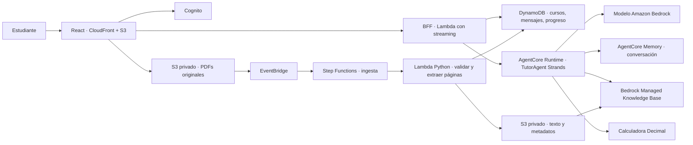

# Arquitectura y orquestación

[Abrir arquitectura AWS interactiva](diagrams/finantutor-aws.html) · [Descargar Draw.io editable](diagrams/finantutor-aws.drawio) · [Fuentes y comprobaciones de los diagramas](diagrams/README.md).

## Decisión: un agente con herramientas

El objetivo es aprender una asignatura con un estilo docente consistente. Un TutorAgent mantiene la conversación, decide cuándo consultar el material y explica los resultados. La recuperación y el cálculo tienen contratos acotados; no necesitan razonamiento autónomo de otros agentes. Añadir especialistas desde el inicio aumentaría llamadas al modelo, latencia y coordinación sin demostrar una mejora pedagógica.

La ingesta es un proceso determinista separado, no un agente. Un sistema multiagente tendría sentido si aparecen tareas extensas e independientes, como evaluar trabajos con una rúbrica confirmada y revisión separada, o contrastar escenarios con varios especialistas. Primero se debe medir la calidad con preguntas y ejercicios reales del curso.

## Turno del tutor

1. El BFF valida el token, la propiedad del curso y el UUID de conversación. Adquiere una exclusión temporal para impedir turnos simultáneos en la misma sesión.
2. Carga el mapa confirmado, los materiales disponibles y el progreso. Fija propietario y curso; el modelo no puede cambiar este ámbito. Persiste la pregunta.
3. Invoca AgentCore con un identificador SHA-256 que combina usuario, curso y conversación. Un nuevo TutorAgent utiliza el contexto de esa sesión.
4. `get_course_outline` consulta el mapa; `search_materials` busca evidencia con filtros por propietario/curso y una segunda comprobación contra el catálogo. `calculate_financial_metric` calcula las operaciones autorizadas. `get_learning_progress` consulta actividades y `record_learning_activity` propone una actividad con evidencia explícita.
5. El runtime limita las herramientas a 12 usos por turno, la generación a 2.500 tokens por llamada y el turno a 105 segundos. Envía fragmentos, estados y latidos de 15 segundos. Un error o timeout no produce una respuesta terminada.
6. Al cerrar el stream, el BFF comprueba las referencias. Guarda respuesta y actividades en una transacción SQLite o DynamoDB y envía `done` únicamente después de confirmar la escritura. El navegador usa ese evento para cerrar el mensaje.

La memoria de AgentCore conserva eventos de conversación 30 días; no hay extracción de recuerdos a largo plazo. El historial y el progreso del BFF son persistentes. En local, se restauran los últimos 20 mensajes del BFF. El tutor distingue contenido citado, ejemplos propios y supuestos. Las citas permiten inspeccionar evidencia; no garantizan por sí mismas que toda explicación sea correcta.

## Ingesta

La URL de carga autoriza un objeto concreto y expira en diez minutos. En AWS el original dispara EventBridge → Step Functions. El worker valida el catálogo, PDF y páginas; escribe fragmentos por página con metadatos de propietario, curso, material, versión y unidad. Inicia la sincronización y espera mediante polling con reintentos. Solo un job COMPLETE sin fallos de documentos marca el material `ready`. Fallos, cancelaciones y timeouts actualizan el catálogo a `failed` mediante seguimiento de eventos del workflow.

Los originales y el corpus se almacenan separados; el tutor recupera únicamente del corpus y de documentos `ready`. CloudFront accede a S3 y a la URL IAM de Lambda mediante OAC. El token Cognito viaja en `x-authorization` para conservarse cuando CloudFront firma la petición al origen; las peticiones con cuerpo incluyen su SHA-256.

## Evolución

Antes de ampliar: comprobar respuestas sobre tus materiales, exactitud de fórmulas y cálculos, referencias por página, ejercicios guiados y comportamiento ante preguntas fuera del sílabo. Posteriormente pueden añadirse OCR, ejercicios estructurados, versionado lógico, políticas de conservación, presupuestos y alarmas. No están incluidos en este MVP.
